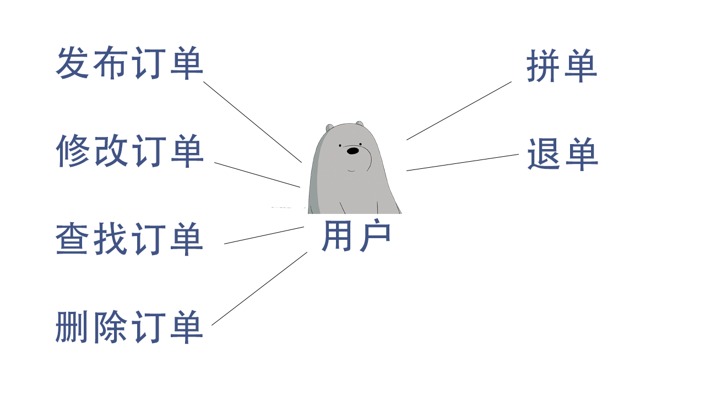
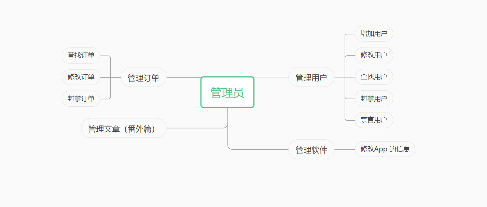
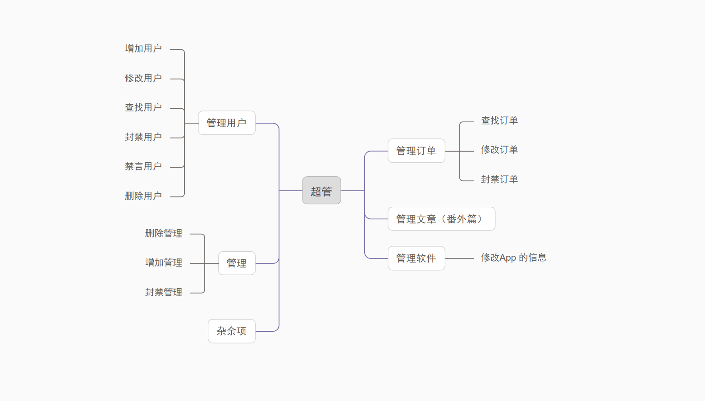

# 项目文档

 ##  1 项目介绍

&emsp; &emsp;从当前的国内外网约车市场来看，网约车模式展现出巨大的发展潜力与广阔前景。全球知名的优步和国内备受欢迎的滴滴打车、阳光出行等网约车企业，都在积极拓展市场，持续壮大自身的发展规模。这些企业通过创新服务模式、提升运营效率以及提供优质的用户体验，赢得了广大乘客的青睐，并在行业内树立了良好的口碑和品牌形象。

&emsp; &emsp;然而，尽管拼车模式在社会层面取得了显著的发展成果，我们却发现专为学校学生提供的拼车服务仍然相对较少。这确实是一个值得关注的挑战，但同时也是一个巨大的市场机遇。为了弥补这一空白，许多网约车企业已经开始积极寻求解决方案，努力在满足社会大众出行需求的同时，更好地服务于学校学生群体。

&emsp; &emsp;为此，我们特别推出了这款专为学校学生打造的拼车服务平台。该平台旨在解决当前学生出行所面临的种种问题，尤其是在拼车服务方面的不足。随着城市化的不断推进和交通压力的日益增大，学生出行问题愈发凸显，传统的出行方式已经难以满足他们日益增长的需求。

&emsp; &emsp;通过我们的平台，学生可以实现出行便捷和节能减排的双重目标。他们可以通过拼车减少单独出行的次数，降低交通拥堵和环境污染，为城市绿色出行贡献一份力量。同时，拼车还能帮助学生节省出行成本，提高出行效率，使他们能够更加专注于学习和生活。

## 2 需求概述

<!-- |0|0| -->

|                  |                                                                                     |
| :---------------: | :---------------------------------------------------------------------------------- |
|    app开发目的    | 解决大学生的拼车问题                                                                |
|  待开发的app名称  | H帮                                                                                 |
|     参考资料     | 阿里云的[校园智能出行拼车系统](https://developer.aliyun.com/article/995887#slide-0) |
| app开发的功能需求 | [点击跳转](./App开发的功能需求.md)                                                  |
|   app的运行环境   | Android App(初步)， 微信小程序，Html网页                                            |
|    条件与限制    |                                                                                     |
|    app功能划分    |                                                                                     |
|     功能描述     |                                                                                     |
|   外部接口需求   |                                                                                     |
|     用户界面     |   [点击跳转](./usercoloer.md) |
|     性能需求     |                                                                                     |

<!-- ##  -->
## 3 功能

 普通用户

管理员

超管

## 4 解决问题

+ 解决大学生的出行问题。
+ 帮助大学生减少出行所花费的金钱。
+ 让学生实现同校拼车，消除安全顾虑。
+ 地点更准确，价钱更明了。
+ 提供一个拼车找搭子的平台。
