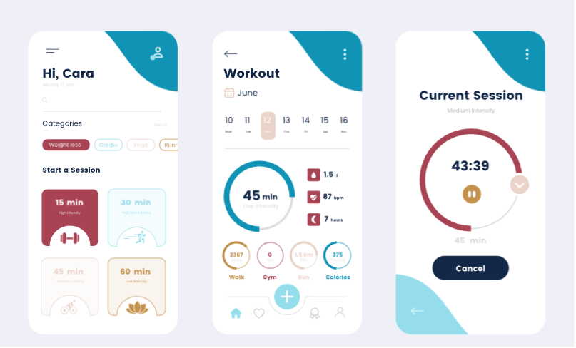
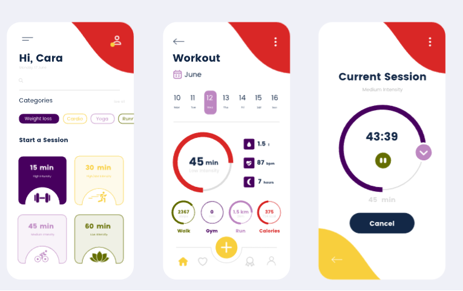
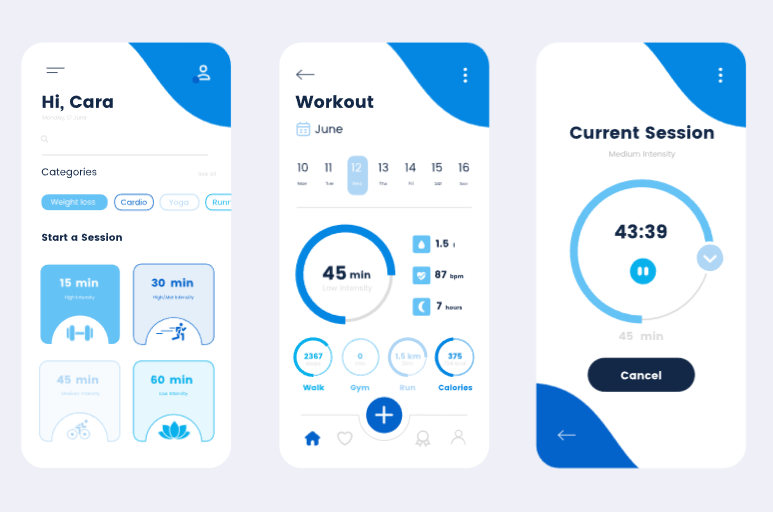

# 用户界面的设计规范

配色
<!-- |name|color|
| :---------------:| :---------------:|
|| -->
## 方案一[色卡文件，点击跳转](./images/color/Stained%20Roses.png)
~~~
#1093B5 #96DDEC #EAD3C9 #A74353 #C3924C
~~~
 
 <!--  -->

 ## 方案二[色卡文件，点击跳转](./images/color/Hip%20Hip%20Hurray.png)
 ~~~
 #D92726

#F8CF3D

#BD87C1

#47005E

#646D00
 ~~~
 

 ## 方案三 [色卡文件，点击跳转](./images/color)
 ~~~
 #0487E2

#0463CA

#B0D6F5

#65C2F5

#09B1EC
~~~

